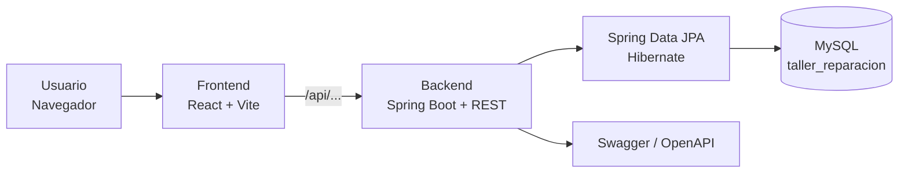

## Proyecto

**Entornos de Programación (24542)**  
**Universidad Industrial de Santander — UIS**  
**Grupo F1 — 2026**

# AutoCore


**Entornos de Programación (24542)** · Universidad Industrial de Santander (UIS) · Grupo F1 · 2026

Aplicación web para la **gestión de un taller de reparación automotriz**. AutoCore permite centralizar la información de clientes, vehículos, repuestos, reparaciones, cotizaciones y ventas, con diferentes interfaces según el rol del usuario.

## ¿Qué hace?

1. **Inicio de sesión y roles:** los usuarios ingresan mediante correo y contraseña. El sistema reconoce los roles `ADMIN`, `TECNICO` y `CLIENTE`.
2. **Paneles por rol:** cada tipo de usuario cuenta con una interfaz orientada a sus funciones dentro del taller.
3. **Clientes:** registro, consulta, actualización y eliminación de clientes.
4. **Vehículos:** gestión de los equipos o vehículos asociados al taller.
5. **Repuestos:** administración del catálogo de repuestos, precios, stock y estado.
6. **Reparaciones:** creación y seguimiento de reparaciones, asignación de técnicos, diagnóstico, estados y repuestos utilizados.
7. **Cotizaciones:** generación de cotizaciones a partir de una reparación, con mano de obra, repuestos, subtotales y total.
8. **Ventas:** consulta de cotizaciones y seguimiento de estados aprobados, pendientes y rechazados.
9. **Reportes:** consulta de indicadores de clientes, repuestos, reparaciones, cotizaciones, ventas e inventario.
10. **Navegación web:** las diferentes pantallas se integran mediante React Router.

## Arquitectura



El frontend se comunica con el backend mediante una API REST. El backend está desarrollado con Spring Boot, Spring Data JPA y Hibernate, y utiliza MySQL como sistema de persistencia.

La documentación específica del backend, sus módulos, endpoints y flujo de reparaciones se encuentra en [backend-spring/README.md](backend-spring/README.md).

## Módulos

| Módulo | Descripción |
|---|---|
| **Login** | Autenticación de usuarios y obtención del rol |
| **Dashboard** | Panel inicial adaptado a cada rol |
| **Clientes** | Gestión de clientes |
| **Vehículos** | Gestión de equipos/vehículos |
| **Repuestos** | Catálogo y administración de repuestos |
| **Inventario** | Consulta del stock de repuestos |
| **Reparaciones** | Gestión del proceso de reparación |
| **Órdenes** | Consulta de órdenes asociadas a reparaciones |
| **Ventas** | Gestión y consulta de cotizaciones |
| **Reportes** | Indicadores generales del taller |
| **Configuración** | Pantalla de configuración del sistema |

## Roles

### Administrador

El administrador tiene acceso a la gestión general del taller:

- Inicio
- Clientes
- Repuestos
- Inventario
- Reparaciones
- Órdenes
- Ventas
- Reportes
- Configuración

### 🔧 Técnico

El técnico cuenta con una interfaz enfocada en el trabajo de taller:

- Inicio
- Mis reparaciones
- Clientes
- Repuestos
- Mi perfil

Puede consultar las reparaciones asignadas y la información necesaria para realizar el diagnóstico y trabajo sobre los vehículos.

### 👤 Cliente

El cliente cuenta con un portal orientado a consultar sus servicios:

- Inicio
- Mis vehículos
- Mis reparaciones
- Mis cotizaciones
- Mis órdenes
- Catálogo de repuestos
- Mi perfil

## Flujo de una reparación

```text
RECIBIDO
   │
   ▼
EN_DIAGNOSTICO
   │
   ▼
COTIZACION_PENDIENTE
   │
   ▼
ESPERANDO_APROBACION
   │
   ├───────────────┐
   │               │
   ▼               ▼
APROBADA        RECHAZADA
   │
   ▼
EN_REPARACION
   │
   ▼
FINALIZADA
   │
   ▼
ENTREGADO
```

El flujo también contempla el estado `RECHAZADO`.

Los repuestos utilizados durante una reparación pueden descontarse del stock y, si se elimina un repuesto utilizado, el stock puede ser devuelto según las reglas implementadas en el backend.

## Cotizaciones y ventas

Las cotizaciones se relacionan directamente con las reparaciones y contienen:

- Reparación asociada
- Mano de obra
- Repuestos
- Detalles de cotización
- Subtotales
- Total
- Estado de aprobación

Los estados comerciales utilizados son:

```text
PENDIENTE
APROBADA
RECHAZADA
```

Cuando una cotización es aprobada, la reparación puede continuar hacia el estado `EN_REPARACION`.

## Reportes

El módulo de reportes permite consultar información general del taller a partir de los datos obtenidos desde la API.

Actualmente incluye indicadores de:

- Clientes registrados
- Repuestos
- Reparaciones
- Cotizaciones
- Cotizaciones pendientes
- Cotizaciones aprobadas
- Cotizaciones rechazadas
- Valor de ventas aprobadas
- Repuestos disponibles
- Repuestos con stock bajo
- Repuestos agotados
- Estado de las reparaciones
- Indicadores comerciales
- Últimas cotizaciones

También permite seleccionar períodos como:

- Todo el historial
- Este mes
- Últimos 30 días
- Últimos 90 días

## Documentación

| Documento | Contenido |
|---|---|
| [README principal](README.md) | Descripción general, arquitectura, módulos y ejecución |
| [README del backend](backend-spring/README.md) | Módulos, endpoints, flujo de reparaciones, login y configuración del backend |
| `backend-spring/src/main/resources/schema.sql` | Estructura de la base de datos |
| `backend-spring/src/main/java/com/proyecto/clases/config/DatosIniciales.java` | Datos iniciales utilizados para las pruebas |
| `frontend/src/services/api.js` | Funciones utilizadas por el frontend para comunicarse con la API |

## Estructura del repositorio

```text
AutoCore/
│
├── backend-spring/
│   ├── src/
│   │   └── main/
│   │       ├── java/
│   │       └── resources/
│   ├── .mvn/
│   ├── mvnw
│   ├── mvnw.cmd
│   ├── pom.xml
│   └── README.md
│
├── frontend/
│   ├── public/
│   │   └── logo.png
│   ├── src/
│   │   ├── assets/
│   │   ├── components/
│   │   ├── pages/
│   │   │   ├── Login.jsx
│   │   │   ├── Dashboard.jsx
│   │   │   ├── DashboardAdmin.jsx
│   │   │   ├── DashboardTecnico.jsx
│   │   │   ├── DashboardCliente.jsx
│   │   │   ├── Clientes.jsx
│   │   │   ├── Inventario.jsx
│   │   │   ├── Reparaciones.jsx
│   │   │   ├── Ordenes.jsx
│   │   │   ├── Ventas.jsx
│   │   │   ├── Reportes.jsx
│   │   │   └── Configuracion.jsx
│   │   ├── services/
│   │   │   └── api.js
│   │   ├── App.jsx
│   │   └── index.css
│   ├── package.json
│   └── vite.config.js
│
├── imagenes/
├── logo.png
├── .gitignore
├── .gitattributes
└── README.md
```

## Cómo ejecutar

AutoCore utiliza tres componentes principales durante la ejecución local:

| Pieza | Comando / servicio | Dirección |
|---|---|---|
| MySQL | Servicio local | `localhost:3306` |
| Backend | `.\mvnw.cmd spring-boot:run` desde `backend-spring/` | `http://localhost:8080` |
| Frontend | `npm run dev` desde `frontend/` | `http://localhost:5173` |

### 1. Base de datos

Es necesario tener MySQL ejecutándose localmente.

La base de datos utilizada por AutoCore es:

```text
taller_reparacion
```

La configuración local se realiza a partir de:

```text
backend-spring/src/main/resources/application-local.properties.example
```

Copiar este archivo como:

```text
backend-spring/src/main/resources/application-local.properties
```

y configurar las credenciales locales de MySQL.

> `application-local.properties` no debe subirse al repositorio porque contiene configuración local y credenciales.

### 2. Backend

Entrar a:

```bash
cd backend-spring
```

Ejecutar en Windows:

```powershell
.\mvnw.cmd spring-boot:run
```

El backend estará disponible en:

```text
http://localhost:8080
```

Swagger:

```text
http://localhost:8080/swagger-ui.html
```

En el primer arranque se crea la base `taller_reparacion`, sus tablas y los datos iniciales. El detalle está explicado en [backend-spring/README.md](backend-spring/README.md).

### 3. Frontend

Abrir otra terminal y entrar a:

```bash
cd frontend
```

Instalar las dependencias:

```bash
npm install
```

Ejecutar:

```bash
npm run dev
```

Vite mostrará la dirección local, normalmente:

```text
http://localhost:5173
```

## API principal

| Módulo | Endpoint base |
|---|---|
| Usuarios | `/api/usuarios` |
| Login | `/api/usuarios/login` |
| Clientes | `/api/clientes` |
| Vehículos | `/api/equipos` |
| Repuestos | `/api/repuestos` |
| Reparaciones | `/api/reparaciones` |
| Cotizaciones | `/api/cotizaciones` |

El backend implementa operaciones CRUD para los módulos principales y operaciones específicas para asignación de técnicos, cambios de estado, diagnósticos, repuestos utilizados y aprobación/rechazo de cotizaciones.

## Estado

### Backend

- [x] API REST con Spring Boot
- [x] Conexión con MySQL
- [x] Spring Data JPA / Hibernate
- [x] Swagger / OpenAPI
- [x] CRUD de usuarios
- [x] CRUD de clientes
- [x] CRUD de vehículos
- [x] CRUD de repuestos
- [x] CRUD de reparaciones
- [x] CRUD de cotizaciones
- [x] Asignación de técnicos
- [x] Cambio de estados de reparación
- [x] Diagnóstico
- [x] Registro de repuestos utilizados
- [x] Aprobación y rechazo de cotizaciones
- [x] Datos iniciales de prueba

### Frontend

- [x] Login conectado con el backend
- [x] React + Vite
- [x] React Router
- [x] Dashboard de administrador
- [x] Dashboard de técnico
- [x] Dashboard de cliente
- [x] Gestión de clientes
- [x] Gestión de repuestos
- [x] Inventario
- [x] Reparaciones
- [x] Órdenes
- [x] Ventas
- [x] Reportes
- [x] Configuración

### En desarrollo

- [ ] Protección completa de rutas según rol
- [ ] Separación completa entre el catálogo de repuestos y el inventario físico
- [ ] Mejoras visuales y de responsive en algunos módulos
- [ ] Mejoras de seguridad para las credenciales y contraseñas
- [ ] Pruebas automatizadas
- [ ] Documentación técnica adicional

## Equipo

| Integrante | Responsabilidades |
|---|---|
| **Jairo Armando Cardozo Mendoza** | Frontend, inventario, interfaz de usuario y Jira |
| **Jose Fernando Estevez Cardenas** | Backend con Spring Boot |
| **Alejandro Sarin** | Base de datos, órdenes, ventas y Node.js |

Los integrantes trabajan de manera coordinada sobre el frontend, backend, base de datos y documentación del proyecto.

