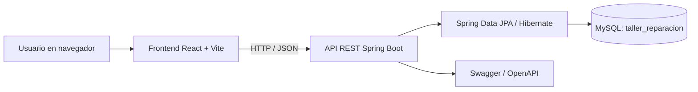

# 🚗 AutoCore


**Proyecto académico:** Entornos de Programación (24542)
**Institución:** Universidad Industrial de Santander (UIS)
**Grupo:** F1 · **Año:** 2026

AutoCore es una aplicación web para gestionar un taller de reparación automotriz. Centraliza clientes, vehículos, repuestos, inventario, reparaciones, cotizaciones, pedidos y ventas, con vistas para los roles de administrador, técnico y cliente.

## Contenido

- [Funcionalidades](#funcionalidades)
- [Tecnologías](#tecnologías)
- [Arquitectura](#arquitectura)
- [Módulos y roles](#módulos-y-roles)
- [Flujo de reparación y cotización](#flujo-de-reparación-y-cotización)
- [Cotizaciones, IVA y factura imprimible](#cotizaciones-iva-y-factura-imprimible)
- [Estructura del proyecto](#estructura-del-proyecto)
- [Requisitos](#requisitos)
- [Configuración y ejecución local](#configuración-y-ejecución-local)
- [API y documentación](#api-y-documentación)
- [Configuración sensible](#configuración-sensible)
- [Equipo](#equipo)

## Funcionalidades

- Inicio de sesión y vistas diferenciadas por rol (`ADMIN`, `TECNICO` y `CLIENTE`).
- Gestión de clientes y vehículos asociados.
- Catálogo de repuestos con precios y estado.
- Control de inventario: cantidades disponibles, entradas, salidas y stock mínimo.
- Gestión de reparaciones, asignación de técnicos y registro de diagnósticos.
- Registro de repuestos utilizados durante una reparación.
- Creación y gestión de cotizaciones vinculadas a reparaciones.
- Aprobación y rechazo de cotizaciones.
- Pedidos asociados a cotizaciones y consulta de órdenes del taller.
- Vista previa e impresión de documentos de cotización/factura de servicio.
- Cálculo de subtotal, IVA y total cuando el desglose de IVA está habilitado y guardado en la cotización.
- Reportes e indicadores generales del taller.

> **Nota:** la factura imprimible del frontend es un documento de gestión. No constituye por sí sola una factura electrónica validada por la DIAN. El porcentaje de IVA debe configurarse de acuerdo con el tratamiento tributario que corresponda.

## Tecnologías

| Componente | Tecnología |
|---|---|
| Frontend | React 19, Vite 8, React Router |
| Backend | Java 17, Spring Boot 3.3.4 |
| API | REST |
| Persistencia | Spring Data JPA, Hibernate |
| Base de datos | MySQL |
| Documentación de API | Swagger / OpenAPI |
| Control de versiones | Git y GitHub |

## Arquitectura



El frontend consume la API REST del backend. Spring Boot valida y procesa las operaciones y utiliza JPA/Hibernate para acceder a MySQL.

## Módulos y roles

| Módulo | Descripción |
|---|---|
| Login | Inicio de sesión y lectura del rol del usuario |
| Dashboard | Panel de acuerdo con el rol |
| Clientes | Datos de los clientes |
| Vehículos | Vehículos asociados a los clientes |
| Repuestos | Catálogo, precios y disponibilidad |
| Inventario | Existencias, movimientos y stock mínimo |
| Reparaciones | Diagnóstico, técnico asignado, estados y repuestos usados |
| Órdenes | Consulta y seguimiento de órdenes de servicio |
| Ventas | Cotizaciones, aprobación/rechazo, pedidos y documentos imprimibles |
| Reportes | Indicadores operativos y comerciales |
| Configuración | Opciones de configuración disponibles en la interfaz |

### Administrador

Gestiona los módulos generales del taller: clientes, repuestos, inventario, reparaciones, órdenes, ventas, reportes y configuración.

### Técnico

Consulta las reparaciones asignadas y la información necesaria para diagnosticar y realizar los trabajos.

### Cliente

Consulta la información de sus vehículos, reparaciones, cotizaciones y órdenes, según las pantallas habilitadas para su rol.

## Flujo de reparación y cotización

```text
RECIBIDO
   |
   v
EN_DIAGNOSTICO
   |
   | Registrar diagnóstico
   v
COTIZACION_PENDIENTE
   |
   | Crear cotización
   v
ESPERANDO_APROBACION
   |                    |
   v                    v
Aprobada              Rechazada
   |                    |
   v                    v
EN_REPARACION         RECHAZADO
   |
   v
FINALIZADA
   |
   v
ENTREGADO
```

El backend controla las transiciones de estado. Registrar el diagnóstico habilita la creación de la cotización; la aprobación permite continuar con la reparación.

### Edición y nueva aprobación

Cuando una cotización se modifica, el subtotal, el IVA y el total deben recalcularse y la cotización debe volver a quedar pendiente de aprobación. La edición no debe alterar silenciosamente un pedido ya creado: si existe un pedido asociado, la operación debe bloquearse o gestionarse mediante un flujo explícito de revisión del pedido.

## Cotizaciones, IVA y factura imprimible

La cotización se relaciona con una reparación e incluye mano de obra y repuestos. Cuando el desglose tributario está habilitado, se almacenan:

- `mano_obra`: valor de la mano de obra.
- `iva_porcentaje`: porcentaje de IVA aplicado.
- `valor_iva`: valor calculado del impuesto.
- `total`: importe total de la cotización.

El cálculo previsto es:

```text
Subtotal = mano de obra + suma de repuestos
IVA      = subtotal × iva_porcentaje / 100
Total    = subtotal + valor_iva
```

La vista de factura puede mostrar el cliente, vehículo, técnico, reparación, detalle del servicio, subtotal, IVA y total, y permite imprimir o guardar el documento como PDF desde el navegador.

### Migración para bases de datos existentes

Si la base `taller_reparacion` ya existía antes de incorporar los campos de IVA, se deben agregar una sola vez. El script recomendado es `database/migration_iva_cotizacion.sql`:

```sql
USE taller_reparacion;

ALTER TABLE cotizacion
    ADD COLUMN iva_porcentaje DECIMAL(5,2)
        NOT NULL DEFAULT 0.00 AFTER mano_obra,
    ADD COLUMN valor_iva DECIMAL(12,2)
        NOT NULL DEFAULT 0.00 AFTER iva_porcentaje;
```

Ejecuta esta migración una sola vez. Los registros anteriores quedan con IVA `0.00` por defecto; revisa y actualiza cada cotización según corresponda. Si las columnas ya existen, no vuelvas a ejecutar el `ALTER TABLE`.

## Estructura del proyecto

```text
AutoCore/
├── backend-spring/
│   ├── src/main/java/com/proyecto/clases/
│   ├── src/main/resources/
│   │   ├── application.properties
│   │   ├── application-local.properties.example
│   │   └── schema.sql
│   ├── mvnw
│   ├── mvnw.cmd
│   ├── pom.xml
│   └── README.md
├── frontend/
│   ├── public/
│   │   └── logo.png
│   ├── src/
│   │   ├── components/
│   │   ├── pages/
│   │   ├── services/api.js
│   │   ├── App.jsx
│   │   └── index.css
│   ├── package.json
│   └── vite.config.js
├── database/
│   └── migration_iva_cotizacion.sql
├── imagenes/
├── .gitignore
└── README.md
```

## Requisitos

- Java 17.
- Node.js y npm compatibles con la versión de Vite del proyecto.
- MySQL Server.
- Git (opcional para ejecutar; necesario para contribuir al repositorio).

## Configuración y ejecución local

### 1. Base de datos

Asegúrate de que el servicio MySQL esté iniciado y de que exista la base de datos `taller_reparacion`. La configuración del backend se realiza mediante las propiedades locales o las variables de entorno.

Para configurar credenciales locales:

1. Copia `backend-spring/src/main/resources/application-local.properties.example`.
2. Guárdalo como `application-local.properties` en la misma carpeta.
3. Completa el usuario y la contraseña de MySQL.
4. Si ya tienes una base de datos creada, comprueba que su esquema esté actualizado; ejecuta la migración de IVA solo si todavía no existen sus columnas.

No subas el archivo `application-local.properties` ni contraseñas al repositorio.

### 2. Backend

Abre una terminal en la carpeta raíz y ejecuta:

```powershell
cd backend-spring
.\mvnw.cmd spring-boot:run
```

Backend: `http://localhost:8080`

Swagger/OpenAPI: `http://localhost:8080/swagger-ui/index.html`

Si Swagger no abre con esa dirección, revisa el mensaje de inicio de Spring Boot y la configuración de springdoc.

### 3. Frontend

Abre una segunda terminal en la raíz del proyecto:

```powershell
cd frontend
npm install
npm run dev
```

Vite normalmente publica la aplicación en `http://localhost:5173`.

## API y documentación

| Módulo | Endpoint base |
|---|---|
| Usuarios y login | `/api/usuarios` |
| Clientes | `/api/clientes` |
| Vehículos | `/api/equipos` |
| Repuestos | `/api/repuestos` |
| Inventario | `/api/inventarios` |
| Reparaciones y diagnósticos | `/api/reparaciones` |
| Cotizaciones | `/api/cotizaciones` |
| Pedidos | `/api/pedidos` |

Los endpoints disponibles y sus métodos HTTP se pueden consultar en Swagger. Las rutas concretas pueden incluir operaciones específicas para asignar técnicos, registrar diagnósticos, cambiar estados, gestionar repuestos, aprobar/rechazar cotizaciones y consultar pedidos.

Para más información sobre los controladores y el flujo del backend, consulta [backend-spring/README.md](backend-spring/README.md).

## Configuración sensible

- No subas contraseñas, tokens ni archivos de configuración local.
- Usa `application-local.properties` para las credenciales locales y mantenlo fuera de Git.
- Antes de publicar el repositorio, revisa que no haya claves reales en archivos de configuración ni datos personales que no deban compartirse.
- Los datos iniciales son para desarrollo/pruebas; cámbialos y aplica medidas de seguridad antes de cualquier despliegue real.

## Estado del proyecto

AutoCore integra frontend React, backend Spring Boot y persistencia MySQL. El alcance actual incluye gestión de clientes, vehículos, repuestos, inventario, reparaciones, cotizaciones, pedidos, ventas y reportes. La cobertura de pruebas automatizadas y el endurecimiento de seguridad continúan siendo áreas de mejora.

## Equipo

| Integrante | Responsabilidades |
|---|---|
| **Jairo Armando Cardozo Mendoza** | Frontend, inventario, interfaz de usuario y Jira |
| **Jose Fernando Estevez Cardenas** | Backend con Spring Boot |
| **Alejandro Sarin** | Base de datos, órdenes, ventas y Node.js |

Proyecto académico de **Entornos de Programación (24542)** · Universidad Industrial de Santander (UIS) · Grupo F1 · 2026.
